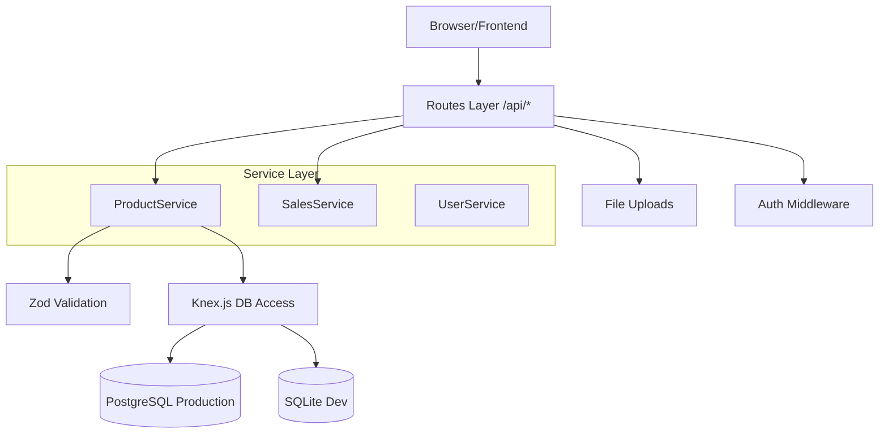

# System Architecture & Design (Layered Evolution)

This document describes the evolved architecture of the POS System v2, transitioning from a Monolithic Route structure to a cleaner, Layered Service Architecture.

## 1. Evolution: Monolith to Layered
Previously, all business logic and SQL were contained within the `routes/` directory. We are now transitioning to a pattern with three distinct layers:

1.  **Transport Layer (`routes/`)**: Handles HTTP requests, file uploads (Multer), sessions, and response status codes.
2.  **Service Layer (`services/`)**: The "Brain" of the system. Handles business rules, complex calculations, and transactional workflows. Uses **Zod** for data validation.
3.  **Data Layer (`db/knex.js`)**: Managed by **Knex.js** query builder. Abstracts away the differences between SQLite and PostgreSQL.

### Refactoring Progress:
- [x] **Product Module**: Consolidated into `ProductService.js`.
- [x] **Sales Module**: Consolidated into `SalesService.js` (including Returns & Customer Ledger).
- [x] **Auth & User Module**: Consolidated into `AuthService.js` and `UserService.js`.
- [x] **Financials Module**: Consolidated into `ExpenseService.js` and `BrandService.js`.
- [x] **Analytics Module**: Consolidated into `AnalyticsService.js`.
- [ ] **Infrastructure Module**: Planned for Phase 6.

## 2. Updated Component Diagram

## 3. Database Entity Model (Unchanged)
The database schema remains the same, but access is now centralized through Knex. Refer to `db/postgres-schema.sql` for the latest table definitions.

## 4. Why this matters for ERP Maintenance
- **Testing**: We can now write "Unit Tests" for `ProductService` without needing to mock an entire Express request/response object.
- **Consistency**: The `getAllProducts` logic is now identical regardless of which endpoint calls it.
- **Safety**: Zod catches bad input before it hits the database, preventing "500 Internal Server Error" crashes.
