# RMS/POS System Architecture Diagrams

This file documents the architecture and system design currently implemented in this repository. It is based on the live code paths in `server.js`, `routes/`, `middleware/`, `db/schema.sql`, `db/db.js`, and `public/js/`.

## 1. Runtime Architecture

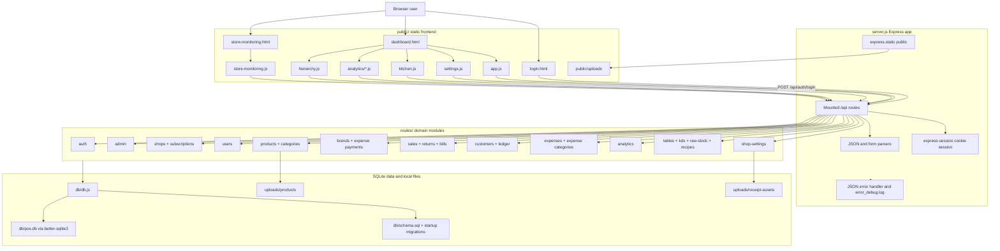

## 2. API Surface By Module

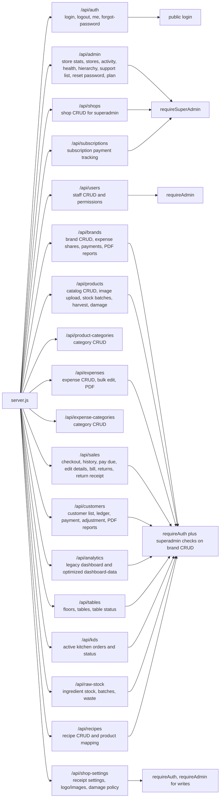

## 3. Authentication, Authorization, And Tenant Isolation

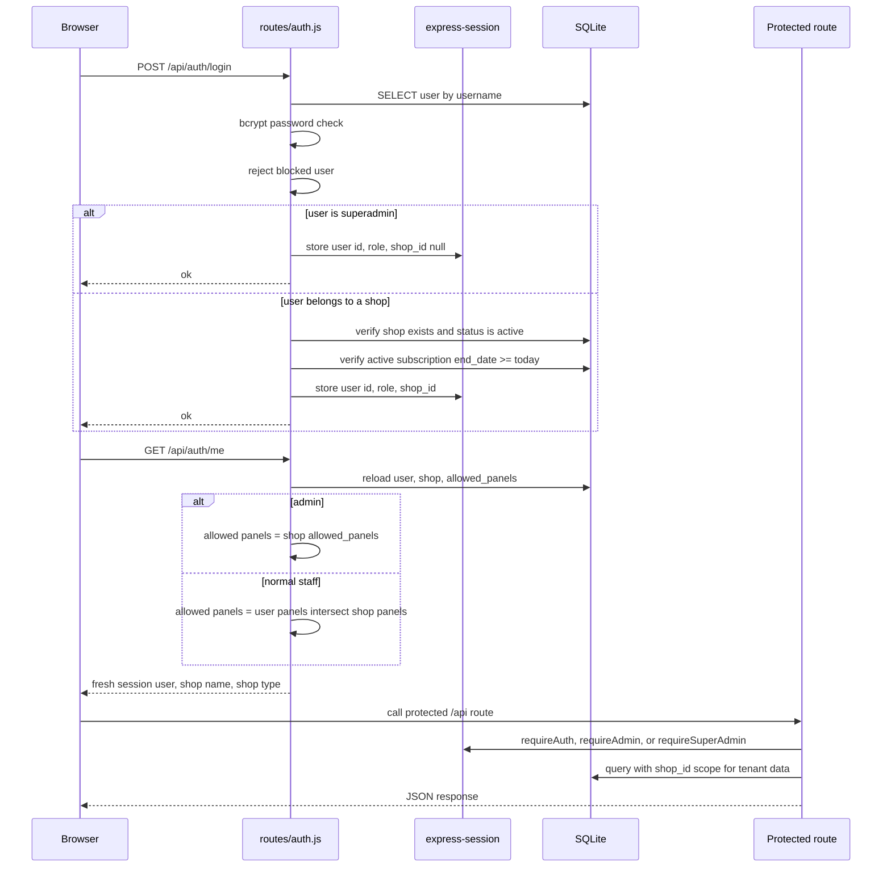

## 4. Frontend Navigation And Panel Model

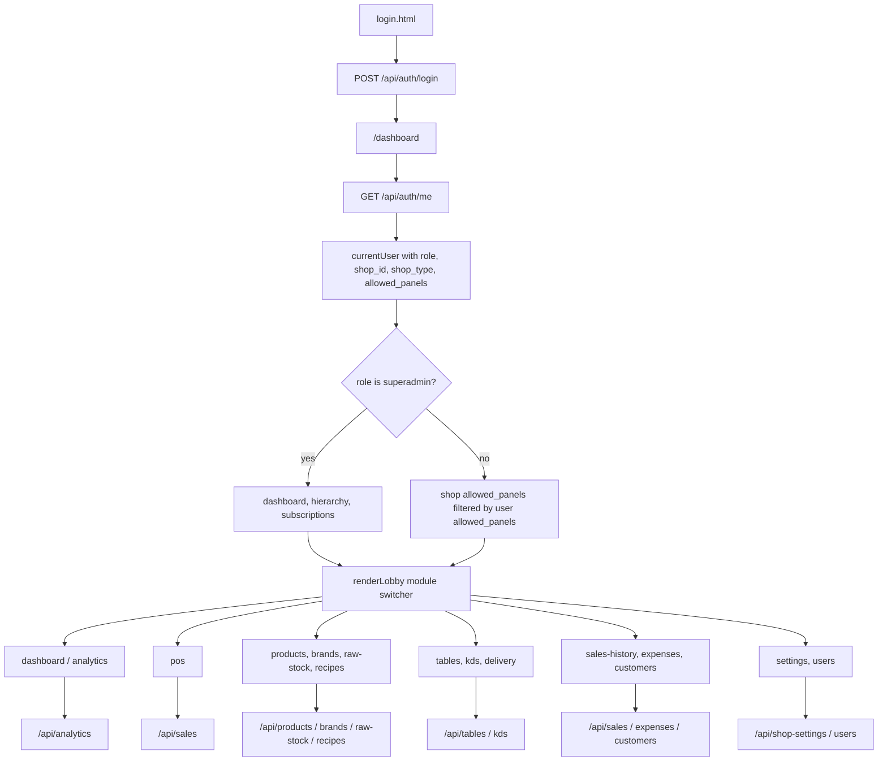

## 5. Database Entity Model

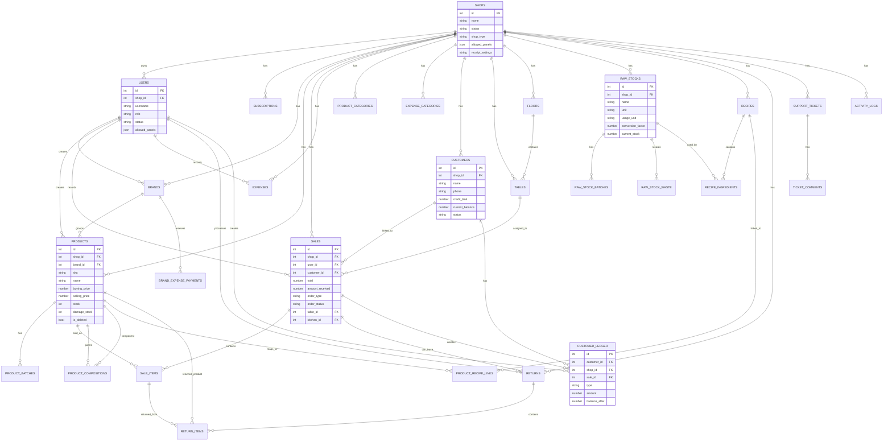

## 6. POS Checkout And Inventory Deduction Flow

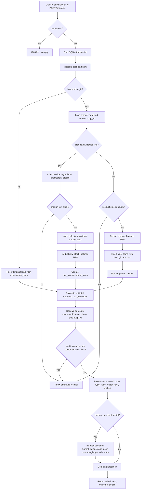

## 7. Sales Returns, Due Payment, And Customer Ledger

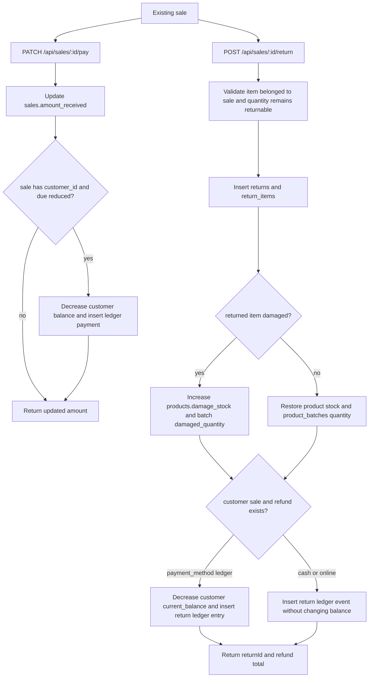

## 8. Restaurant RMS Flow

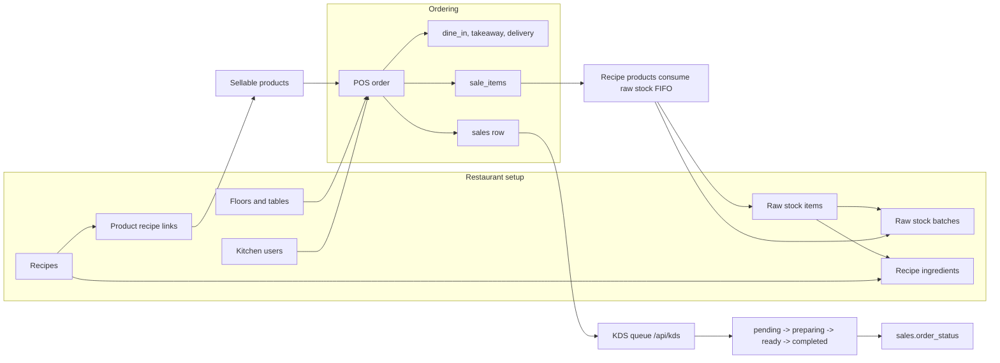

## 9. Product Catalog, Batches, Composite Products, And Damage

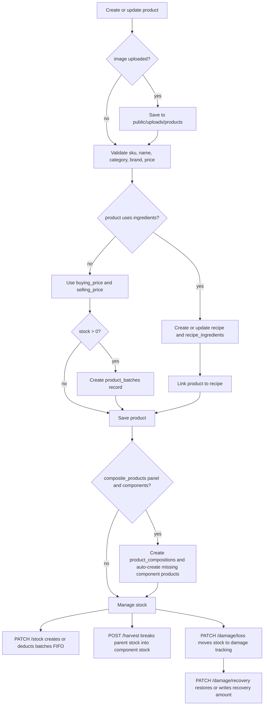

## 10. Superadmin Platform Management

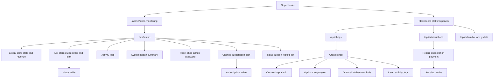

## 11. Reporting, PDF, And Upload Paths

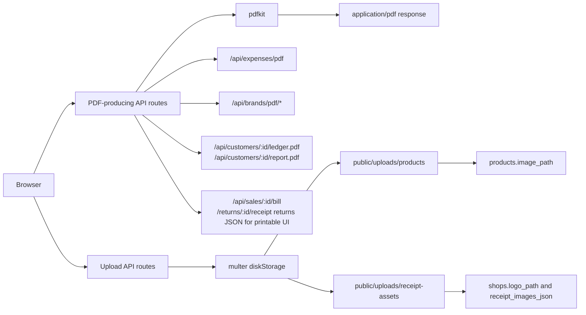

## 12. Current Implementation Notes

```mermaid
flowchart TD
  Notes["Implementation notes from current code"] --> Monolith["Single Express monolith with domain route modules"]
  Notes --> MultiTenant["Most operational reads and writes are scoped by shop_id"]
  Notes --> SessionAuth["Session cookie auth, not JWT"]
  Notes --> SQLite["SQLite with WAL, PRAGMAs, startup migrations, and indexes"]
  Notes --> Panels["Panel permissions are JSON arrays on shops and users"]
  Notes --> ShopTypes["shop_type switches retail vs restaurant behavior in frontend"]
  Notes --> FIFOBatches["Product and raw stock deductions use FIFO batches"]
  Notes --> Reports["Reports are generated synchronously through pdfkit"]
  Notes --> Uploads["Uploaded images are stored locally under public/uploads"]
  Notes --> SupportGap["Support tables exist and admin list route exists, but /api/support is not mounted"]
  Notes --> SchemaGap["customer and receipt/RMS additions are partly in startup migrations, not only schema.sql"]
```

